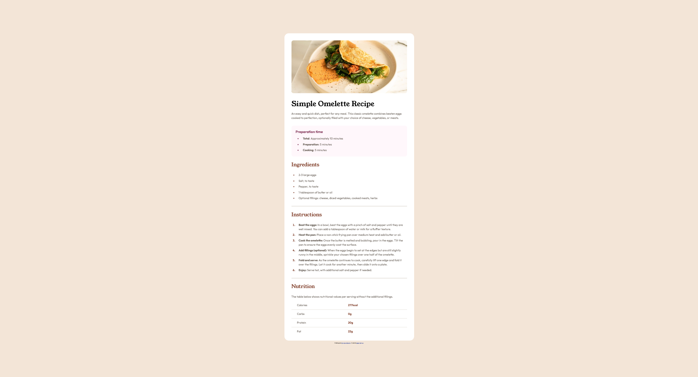

# Frontend Mentor - Recipe page solution

This is a solution to the [Recipe page challenge on Frontend Mentor](https://www.frontendmentor.io/challenges/recipe-page-KiTsR8QQKm). Frontend Mentor challenges help you improve your coding skills by building realistic projects. 

## Table of contents

- [Overview](#overview)
  - [The challenge](#the-challenge)
  - [Screenshot](#screenshot)
  - [Links](#links)
- [My process](#my-process)
  - [Built with](#built-with)
  - [What I learned](#what-i-learned)
  - [Continued development](#continued-development)
  - [Useful resources](#useful-resources)
- [Author](#author)

## Overview

### Screenshot



### Links

- Solution URL: [solution](https://github.com/huang-emily/recipe-page)
- Live Site URL: [live site](https://huang-emily.github.io/recipe-page/)

## My process

### Built with

- Semantic HTML5 markup
- CSS custom properties
- Flexbox
- Mobile-first workflow

### What I learned

A couple of things I learned from this exercise:
- Applying media queries ```@media screen and (min-width: 480px){}```
- Styling the ```<table></table>``` HTML tag
- Styling the ```<ol></ol>``` HTML tag and ```<ul></ul>``` HTML tag
- Using the ```min()``` CSS function

#### Media Queries
After playing around with ```clamp()```, I had to learn to use the media queries since ```clamp()``` assumes you want to add some minimum value, not a straight zero. Because the mobile view removes the padding from card, I needed to start learning to use the media queries. 

#### Styling the table and ol/ul HTML tag
Another thing I noticed was the spacing around the text for the ordered and unordered list. The way it was designed called for the bullet marker to be placed outside, but all of the content needed to push under the the title of the section. I also learned the spacing between the bullet marker and list value can be pretty sensitive, and it needs to be on the list value rather than the broader list. 

For the table, a lot of new learnings. The borders for each value is individual, so you must customize the borders to collapse if you're looking to have the cells be joined together. It was also interesting learning how to apply the border at a specific side of the cell. 

#### Using the min() CSS function
Because the image goes from taking up the entire width of the screen to establishing itself within the container of the recipe, I needed a function that would switch between the two which is where ```min()``` was perfect for this. I had read about it when trying to learn how to use ```clamp()```. 

### Continued development

I now see the different use cases for media queries, ```min()```, and ```clamp()```. I want to continue to practice between these types of functions. Media queries can be super convoluted if you try to spread them across smaller pieces, so that's where the two CSS functions come in. However, the two CSS functions can only do so much. Learning when to use these will definitely come in handy as I practice more.

### Useful resources

Stack Overflow is an amazing resource and helped me greatly for this exercise. Here are a couple threads that helped me with this exercise:

- [Is there a way to make numbers in an ordered list bold?](https://stackoverflow.com/questions/21369843/is-there-a-way-to-make-numbers-in-an-ordered-list-bold) - This helped me learn about the ```:marker``` property for the lists. 
- [How do I set vertical space between list items?](https://stackoverflow.com/questions/19254411/how-do-i-set-vertical-space-between-list-items) - This helped me learn about the adjacent siblings selector. It'll be interesting to see where it can be applied because I imagine this can't be applied to every single grouped tags (or maybe it can, we'll see).
- [CSS Control space between bullet and li](https://stackoverflow.com/questions/4373046/css-control-space-between-bullet-and-li) - This helped me learn about spacing between the bullet marker and the list value. 
- [Equal sized table cells to fill the entire width of the containing table](https://stackoverflow.com/questions/1457563/equal-sized-table-cells-to-fill-the-entire-width-of-the-containing-table) - This helped me learn about the ```border-collapse``` property for tables! 
-[What is my screen size?](https://www.whatismyscreensize.com/blog/mobile-screen-sizes) - This helped me decide on the ```min-width``` for the screen media query since I noticed the tablet and desktop view were a lot more similar compared to the mobile view.

## Author

- Website - [Emily Huang](https://www.emilyhuang.io/)
- Frontend Mentor - [@huang-emily](https://www.frontendmentor.io/profile/huang-emily)

